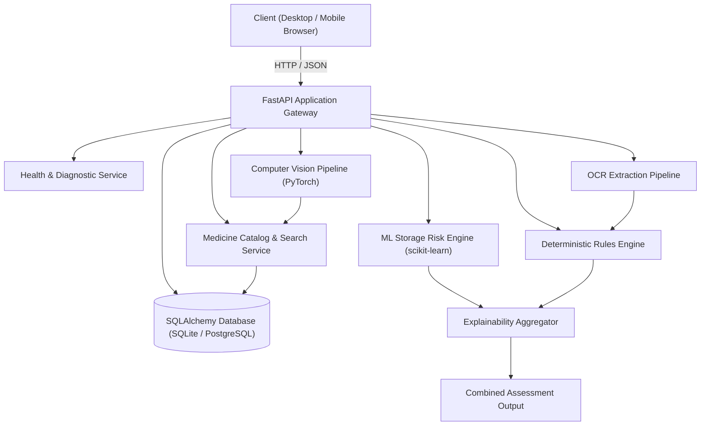

# MediShelf AI — Architectural Design Document

This document describes the high-level system architecture, component interaction boundaries, and data contracts for **MediShelf AI**.

---

## 1. System Decomposition

MediShelf AI is built on a modular, decoupled architecture consisting of four core functional layers:



---

## 2. Component Responsibilities

### 2.1 Frontend Client (`src/`)

- Built with **TanStack Start, React 19, TypeScript, Vite 8, and Tailwind CSS v4**.
- File-based routing under `src/routes/`; the app shell lives in `src/components/AppShell.tsx`.
- `src/lib/api.ts` is the single typed transport layer. It targets an absolute
  `VITE_API_BASE_URL` (default `http://127.0.0.1:8000`) rather than a Vite dev proxy, because
  the hosted sandbox strips `server.proxy` from the Vite config — a proxy would work locally
  and fail in preview.
- `src/lib/queries.ts` holds the shared react-query hooks. Every query uses `retry: false`:
  the dominant failure is "the Python API is not running", and retrying only delays the
  message that says so.
- **No page hardcodes a metric.** Catalog counts, class counts, accuracy figures, and model
  metadata are all fetched. `src/lib/activity.ts` keeps scan and assessment results in
  `sessionStorage` so the Overview and Alerts pages show real session history or an honest
  empty state instead of sample data.
- Deterministic compliance and ML risk are rendered as separate, differently badged panels,
  and the UI states outright when they disagree.

### 2.2 Backend Gateway (`backend/app/`)

- Built with **FastAPI** providing high-performance, asynchronous REST API endpoints.
- Uses **SQLAlchemy 2.0** with dialect abstraction (SQLite for development, PostgreSQL in production).
- Automatically executes idempotent dataset seeding on initial startup.
- Implements strict Pydantic v2 schemas for all request payloads and response envelopes.

### 2.3 Medicine Database Schema (`backend/app/models/medicine.py`)

```text
Table: medicines
  id: Integer (Primary Key, Autoincrement)
  medicine_id: String(32) [UNIQUE, INDEXED]
  medicine_name: String(255) [INDEXED]
  generic_name: String(255)
  brand_name: String(255) [Nullable]
  strength: String(100)
  dosage_form: String(100)
  category: String(100) [INDEXED]
  manufacturer: String(255) [Nullable]
  storage_min_temperature: Float
  storage_max_temperature: Float
  storage_min_humidity: Float [Nullable]
  storage_max_humidity: Float [Nullable]
  expiry_warning_days: Integer (default=60)
  image_class: String(100) [UNIQUE, INDEXED]
  source: String(255)
  source_url: String(1024)
  created_at: DateTime(timezone=True)
  updated_at: DateTime(timezone=True)
```

### 2.4 API Endpoints (Medicines & Core)

- `GET /api/medicines` — Paginated list with `page`, `page_size`, `category`, and `search` parameters.
- `GET /api/medicines/search?q={query}` — Quick search across medicine name, generic name, brand name, and image class.
- `GET /api/medicines/categories` — Distinct therapeutic categories with SKU counts.
- `GET /api/medicines/{medicine_id}` — Single medicine detail with full storage metadata.
- `GET /api/models` — Model transparency endpoint. Reads `ml/artifacts/**` at request time and
  returns architecture, training provenance, hyperparameters, per-epoch history, benchmark
  metrics, confusion matrices, feature importances, the candidate-algorithm comparison, and the
  independent verification report from `tools/verify_models.py` when present. It also derives
  plain-language `limitations` from the artifacts. Every router is mounted under both `/api`
  and `/api/v1`.

Serving these figures from the artifacts rather than from constants in the UI means retraining
cannot silently leave stale accuracy numbers on screen.

### 2.5 Multi-Modal Scanning & OCR Pipeline (Phase 4)

- **Pre-OCR Image Quality Gate (`backend/app/ocr/preprocess.py`)**:
  - Validates minimum dimensions (64x64).
  - Blur detection via Laplacian variance (threshold 45.0).
  - Exposure checks: underexposed darkness (< 38.0) and overexposed glare (> 238.0).
  - Returns `ImageQualityAssessment` with resolution, blur score, exposure, issues, and actionable recommendations.
  - Short-circuits when clearly degraded to avoid unnecessary CPU load.
- **Optical Character Recognition Engine (`backend/app/ocr/extractor.py`)**:
  - Uses genuine **EasyOCR 1.7.2** (CRAFT text detector + CRNN deep learning recognition).
  - Thread-safe lazy singleton initialization in CPU mode (`Reader(['en'], gpu=False)`).
  - Returns exact line text, character confidence score, and polygon bounding box coordinates.
- **Structured Packaging Information Parser (`backend/app/ocr/parser.py`)**:
  - **Expiry Date**: Extracts patterns (`EXP 08/2027`, `EXP: 08-2027`, `EXP 2027-08`, `EXP DATE 08/27`, `EXPIRY 08/2027`, `08/2027`, `2027/08`, `08-2027`, `08/27`).
  - **Strict Date Normalization**: Expiry dates without an explicit day are normalized strictly to `YYYY-MM` (`2027-08`). Exact days are never fabricated. If unconfident, `expiry_date` is `null`.
  - **Batch/Lot Number**: Identifies `LOT ABC123`, `LOT: ABC123`, `BATCH ABC123`, `BATCH NO: ABC123`, `B/N ABC123`, `BN: ABC123` with contextual keyword exclusion.
  - **Dosage Strength**: Identifies and standardizes single, concentration, and combination strengths (`500 mg`, `20 mg`, `100 mg/5 mL`, `100 IU/mL`, `90 mcg`, `875 mg / 125 mg`).
  - **Medicine Database Match**: Scans candidate tokens against the SQLite medicine catalog using SequenceMatcher fuzzy matching, robust to case differences and OCR noise.
- **Explainable Multi-Modal Decision Fusion (`backend/app/ocr/fusion.py`)**:
  - Synthesizes MobileNetV3-Small visual predictions with OCR packaging text into 4 consensus statuses:
    - `CONFIRMED`: High CV confidence corroborating OCR active ingredient/medicine title.
    - `PARTIAL`: Moderate CV confidence or OCR catalog match with incomplete agreement.
    - `DIVERGENT`: High CV confidence conflicts with OCR text (e.g. Visual Paracetamol vs Packaging Ibuprofen).
    - `UNCONFIRMED`: Insufficient evidence from both modalities.
  - Every status produces human-readable, non-clinical explanations ("Identification evidence is consistent").
- **Scanning API Endpoints**:
  - `POST /api/ocr` & `POST /api/v1/ocr`: Dedicated OCR label extraction endpoint.
  - `POST /api/scan` & `POST /api/v1/scan`: Full multi-modal scanning pipeline (Quality Gate -> CV -> OCR -> Parsing -> DB Match -> Fusion -> Storage Monograph).
- **Degraded-mode behaviour**: the EasyOCR weights are a separate ~100 MB download, so the scan
  endpoint treats OCR as optional infrastructure. Image quality is assessed independently of the
  OCR call and `ocr_status` reports the real outcome:
  - `completed` — text was read.
  - `skipped_low_quality` — the image failed the quality gate, so OCR was deliberately not
    attempted; reading a blurred label yields plausible but wrong characters.
  - `unavailable` — the engine could not be loaded. CV recognition and monograph retrieval still
    return, and the response message states that the result rests on the visual model alone.

  Conflating the last two was a real defect: a missing engine used to surface to the user as
  "image quality is insufficient", which points at the wrong fix.

- **Privacy & Data Protection**:
  - Temporary in-memory processing only; uploaded packaging photos are never persisted to disk by default.
  - MIME type and 15MB file size enforcement.

---

## 3. Data Provenance & Ethical Separation

Storage requirements originate solely from regulatory drug monographs (FDA DailyMed / USP). Computer vision identifies the package class, OCR extracts physical label typography, and the multi-modal fusion layer evaluates agreement between modalities without altering ground truth. The system never claims medical certification or replaces licensed healthcare providers.
